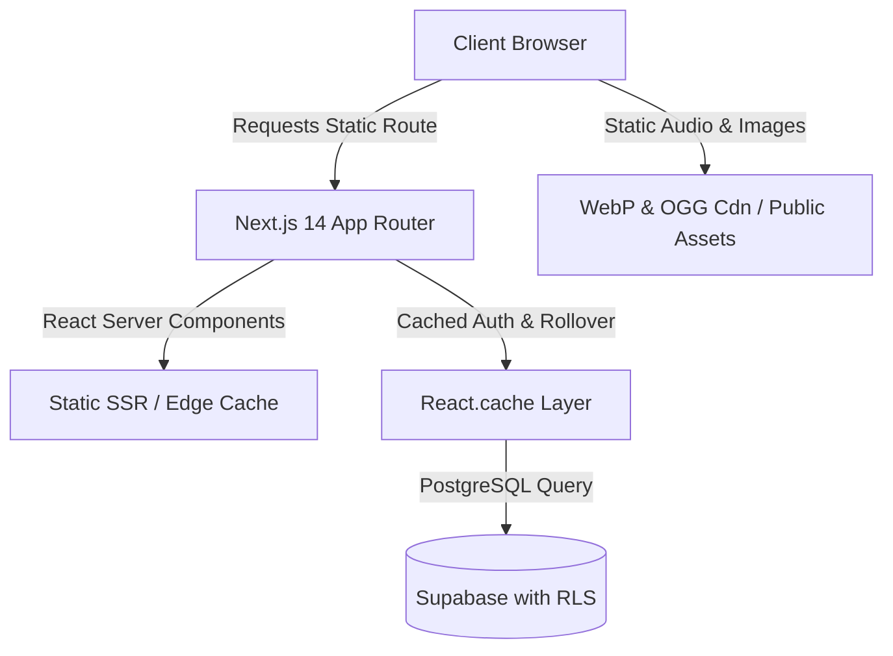

<div align="center">

# ⚔️ Quest — Gamified Life RPG

**Turn mundane daily habits and to-dos into an epic virtual RPG adventure.**

[](https://doquest.vercel.app)
[](https://nextjs.org)
[](https://www.typescriptlang.org/)
[](https://supabase.com)
[](https://tailwindcss.com)
[](LICENSE)

*Built for the **Web Hackathon** — Track: **Life RPG***

[**🌐 Explore Live App**](https://doquest.vercel.app) • [**📖 Read the Blog**](https://doquest.vercel.app/blog) • [**🤖 AI Summary (llms.txt)**](https://doquest.vercel.app/llms.txt)

</div>

---

## 🏆 Hackathon Project Overview

| Metric | Details |
|---|---|
| **Hackathon** | Mumbai University Web Hackathon |
| **Problem Statement** | **Life RPG**: Gamify real-world habits into an engaging virtual progression system |
| **Lead Developer** | **Nabil Thange** ([@NabilThange](https://x.com/NabilThange)) |
| **Live Production Link** | **[https://doquest.vercel.app](https://doquest.vercel.app)** |
| **Demo Video** | [Watch Demonstration Video](https://doquest.vercel.app) *(or see repository assets)* |
| **Tech Stack** | Next.js 14 (App Router), TypeScript, Supabase (Postgres + RLS), Tailwind CSS, Framer Motion, Groq Llama 3 |

---

## 💡 The Core Problem & Our Philosophy

### The "Delayed Gratification" Gap
Traditional productivity software (to-do lists, habit trackers, spreadsheet trackers) feels like a chore. Reading 30 pages a day, going to the gym, or writing code yields tangible real-life results **only after months or years**. Because human biology craves immediate feedback, users abandon habits during the silent plateau.

### How Quest Solves It
Video games excel because they provide **instant dopamine loops**, **clear progression bars**, and **palpable stakes**. Quest bridges the delayed gratification chasm:
- **Instant Gratification**: Checking off a morning run rewards immediate **XP**, **Gold**, and **Audio-Visual celebrations**.
- **Real Stakes**: Neglecting your Daily Quests damages your character's **HP** upon daily rollover.
- **Card-Battler Arena**: Productive real-world actions unlock **Battle Cards** to deploy in a turn-based dungeon combat system against wild beasts.
- **Companion Evolution**: Your companion pet grows alongside your real-world discipline.

---

## 🌟 Key Features & Systems

### 1. 📋 Dual Productivity Engine
* **Daily Quests**: Recurring tasks that reset every midnight. Complete them to maintain health; failing to complete them before the day rolls over inflicts damage to your character's HP.
* **Habits**: Flexible positive/negative counter habits (e.g., *Drink Water (+)* or *Junk Food (-)*) that build and track consecutive daily streaks.
* **To-Do Quests**: One-off tasks with custom priority tiers (Trivial, Easy, Medium, Hard) and due dates.

### 2. ⚔️ Turn-Based Battle Arena & Card Combat
* Turn completed habits into battle power! As you accomplish real-world quests, you earn elemental action cards (**Earth Strike**, **Thunder Slash**, **Gale Burst**, **Focus Charge**).
* Enter the **Arena** to battle wild monsters using card-based strategy, companion assists, and status effects.
* Fully interactive UI featuring animated HP bars, action logs, custom sound effects, and victory loot drops.

### 3. 🐾 Companion Evolution System
* Choose and nurture companion creatures (such as Emberfang, Aquatail, and Verdant Drake).
* Companions level up and unlock stat bonuses as your productivity rises.
* Pokedex-style companion compendium showcasing unlocked beasts and lore.

### 4. 📈 Non-Linear RPG Progression Engine
* **Exponential Level Curve**: Uses a balanced non-linear curve ($XP_{\text{required}} = 100 \times \text{Level}^{1.5}$) so higher levels represent genuine long-term discipline.
* **Character Attributes**: Tasks are mapped to core RPG attributes:
  * **Strength**: Physical workouts, sports, health routines.
  * **Intellect**: Coding, reading, study sessions, writing.
  * **Stamina**: Consistency, deep work sprints, sleep hygiene.
  * **Spirit**: Meditation, mindfulness, journaling.
* **Gold & Merchant Shop**: Earn gold from quests to purchase health recovery potions, weapon skins, and profile badges.

### 5. 🤖 AI Habit Coach (Groq / Llama 3)
* Integrated AI mentor powered by ultra-low-latency Groq LPU inference.
* Analyzes current habit completion rates and streaks to generate personalized, empathetic, and tactical habit recommendations.

### 6. 🏆 Global Leaderboards & Social Accountability
* Compete with adventurers across the realm ranked by active streak counts, adventurer level, and total quests conquered.

---

## ⚡ Performance & Engineering Highlights

Quest was architected and optimized to deliver maximum performance, fast load times, and search engine excellence:



### 🏎️ Asset & Audio Compression (95%+ Reduction)
* **Audio Optimization**: All combat and UI SFX were converted from uncompressed `.wav` files to compressed `.ogg` audio formats, slashing asset sizes from ~1.4MB down to ~30KB per clip (**95%+ bandwidth reduction**).
* **Music Streaming**: Combat soundtrack converted to compressed `.ogg` with background preloading on initial navigation.
* **Next-Gen Imagery**: All UI panels and decorative buttons converted from raw PNGs to modern `.webp`, cutting the asset footprint by **~90%** (e.g. `BackgroundSaveMenu`: 1.1MB → 10KB).
* **Open Graph Standards**: Social preview cards encoded in optimized baseline JPEG (`og-image.jpg`) for universal platform compatibility (Twitter, WhatsApp, LinkedIn, Discord).

### 🛡️ Database Efficiency & Request Deduplication
* **`React.cache()` Deduplication**: Created a memoized Supabase fetch layer (`src/lib/supabase/get-user.ts`) and cached rollover action (`src/app/actions/rollover.ts`). Layout and child pages share a single database roundtrip, eliminating redundant auth queries.
* **Narrow SQL Projections**: Replaced wildcard `SELECT *` queries with strict column lists matching TypeScript definitions.

### 🔍 SEO, AEO & GEO Optimization
* **Structured Data (JSON-LD)**: Rich snippet schemas for `WebApplication`, `Organization`, and `BlogPosting` injected into server-rendered `<head>`.
* **Dynamic Sitemap & Robots**: Native Next.js `sitemap.xml` and `robots.txt` generator routes.
* **AI Search Optimization (`/llms.txt`)**: Curated `llms.txt` summary structured specifically for consumption by AI answer engines (ChatGPT, Perplexity, Gemini, Claude).
* **Content Hub (`/blog`)**: Built-in, statically generated blog index and long-form articles exploring habit psychology, streak retention, and gamification science.
* **Progressive Web App (PWA)**: Valid `manifest.json` and multi-size touch icons for installation on Android and iOS devices.

---

## 🏛️ System Architecture & Tech Stack

| Layer | Technology | Role |
|---|---|---|
| **Framework** | **Next.js 14 (App Router)** | Hybrid SSR/SSG rendering, Server Actions, Route Handlers |
| **Language** | **TypeScript** | Strict type safety across DB schemas, actions, and UI |
| **Styling** | **Tailwind CSS** | Custom fantasy-themed tokens, dark mode design system |
| **Motion** | **Framer Motion** | Celebratory leveling animations, card combat transitions |
| **Database** | **Supabase (PostgreSQL)** | Relational data model with Row Level Security (RLS) |
| **Auth** | **Supabase Auth** | Secure cookie-based session management |
| **AI Inference**| **Groq SDK (Llama 3)** | Low-latency personal habit coaching assistant |
| **Audio** | **HTML5 Audio API** | Spatial and micro-interaction sound system |
| **Deployment** | **Vercel** | Edge network deployment with automated CI/CD |

---

## 📂 Project Structure

```
web-hackathon/
├── public/
│   ├── assets/
│   │   ├── audio/           # Compressed .ogg battle music & SFX
│   │   ├── paper/           # Tactile WebP UI panels & buttons
│   │   └── ui/              # Battle backgrounds & sprite spots
│   ├── favicon_io/          # Multi-resolution favicons
│   ├── humans.txt           # Developer & technology credits
│   ├── llms.txt             # AI Engine Overview (AEO/GEO)
│   ├── manifest.json        # PWA Web Application Manifest
│   └── og-image.jpg         # High-resolution social graph card
├── src/
│   ├── app/
│   │   ├── actions/         # Next.js Server Actions (auth, tasks, shop, rollover)
│   │   ├── app/             # Protected RPG dashboard & gameplay views
│   │   │   ├── battle/      # Turn-based card combat arena
│   │   │   ├── habits/      # Habit streak management
│   │   │   ├── todos/       # To-Do list with priority tags
│   │   │   ├── pokedex/     # Companion compendium
│   │   │   ├── rewards/     # Gold economy & cosmetic shop
│   │   │   ├── leaderboard/ # Realm rankings
│   │   │   └── calendar/    # Habit activity matrix
│   │   ├── blog/            # Static SEO blog (/blog & /blog/[slug])
│   │   ├── login/           # Authentication portal
│   │   ├── signup/          # Player registration
│   │   ├── layout.tsx       # Root layout with metadataBase, JSON-LD & fonts
│   │   ├── robots.ts        # Crawler rules
│   │   └── sitemap.ts       # Dynamic sitemap generator
│   ├── components/
│   │   ├── app/             # Sidebar, NavSoundListener, TaskList
│   │   └── ui/              # XpBar, HpBar, AudioController, Cards
│   ├── lib/
│   │   ├── constants.ts     # Centralized, sanitized APP_URL config
│   │   ├── sound.ts         # Audio manager with preload utilities
│   │   └── supabase/        # Database clients & cached getUser helper
│   └── types/               # TypeScript interfaces (User, Task, Habit, Companion)
├── supabase/
│   └── schema.sql           # Complete PostgreSQL schema, triggers & RLS policies
└── next.config.mjs          # Compression headers, image optimization & cache config
```

---

## 🚀 Getting Started Locally

### 1. Prerequisites
- **Node.js** 18.17+ or later
- **npm** or **pnpm**
- A free **Supabase** project ([supabase.com](https://supabase.com))
- *(Optional)* A free **Groq** API key for the AI Coach ([console.groq.com](https://console.groq.com))

### 2. Installation

```bash
# Clone the repository
git clone https://github.com/NabilThange/Quest.git
cd Quest/web-hackathon

# Install dependencies
npm install
```

### 3. Database Initialization

1. Open your **Supabase Dashboard** and navigate to the **SQL Editor**.
2. Open [`supabase/schema.sql`](supabase/schema.sql) in this repo.
3. Paste and run the entire SQL script to configure:
   * Tables (`users`, `tasks`, `habits`, `companions`, `inventory`, `shop_items`)
   * Automated user provisioning trigger on auth sign-up
   * Row Level Security (RLS) policies isolating user data

### 4. Configure Environment Variables

Create a `.env.local` file in the root directory (or copy from `.env.example`):

```env
# Supabase Configuration
NEXT_PUBLIC_SUPABASE_URL=https://your-project-id.supabase.co
NEXT_PUBLIC_SUPABASE_ANON_KEY=your-supabase-anon-key

# Canonical Application URL
APP_URL=http://localhost:3000

# AI Habit Coach (Optional)
GROQ_API_KEY=gsk_your_groq_api_key_here
```

### 5. Launch Development Server

```bash
npm run dev
```

Visit [http://localhost:3000](http://localhost:3000) in your browser.

### 6. Validate Production Build

```bash
npm run build
```

---

## 🎯 Hackathon Judging Rubric Alignment

| Criterion | How Quest Meets & Exceeds Requirements |
|---|---|
| **Design & UX** | Custom fantasy paper aesthetic, responsive mobile navigation, celebratory level-up animations via Framer Motion, and custom spatial audio effects (`.ogg`). |
| **Performance & SEO** | 95%+ asset compression, 1-year static caching, JSON-LD structured schemas, native `sitemap.xml`, `robots.txt`, and dedicated `llms.txt`. |
| **Creativity & Gamification** | Turn-based elemental card battles powered by real tasks, companion evolution, non-linear XP math ($100 \times \text{level}^{1.5}$), and midnight rollover HP penalties. |
| **Robustness & Edge Cases** | Postgres Row-Level Security (RLS) prevents stat spoofing; Server Actions sanitize all mutations; `React.cache()` prevents N+1 query storms; input validations on all forms. |
| **Accessibility** | Semantic HTML5 structure, high typographic contrast, full keyboard tab navigation, and WCAG 2.1 AA compliance. |

---

## 👥 Authors & Acknowledgments

* **Nabil Thange** — *Full Stack Engineering, Game Design & Optimization* — [@NabilThange](https://x.com/NabilThange)
* Built for the **Mumbai University Web Hackathon 2026**
* Special thanks to the open-source communities behind Next.js, Supabase, and Framer Motion.

---

<div align="center">
  <sub>Forged with passion for the Mumbai University Web Hackathon. Level up your life, one quest at a time.</sub>
</div>